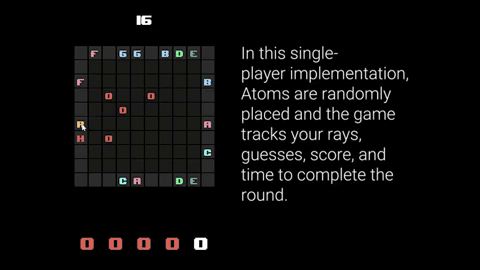
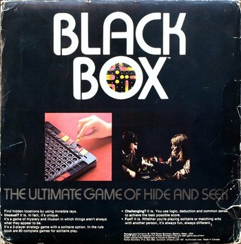
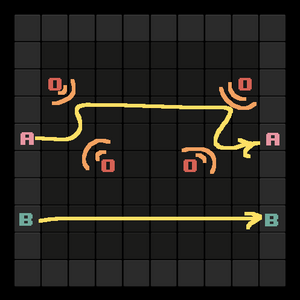
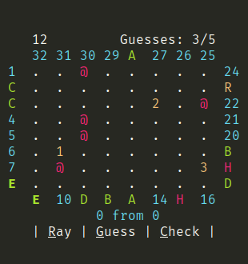

BlackBox is a puzzle game for desktop and mobile -- and a remake of a board game [Black Box](<https://www.wikipedia.org/en/Black_Box_(game)>). Its tagline: _The ultimate game of hide and seek._

> [You can watch a minute-long showcase of BlackBox on YouTube!](https://youtu.be/U_9OyG2_kts)

Published by Parker Brothers in the late 70s, the board game has been out of print quite some time. I came upon a copy in a used game store. The game had a serious retro-coolness about it, and it seemed vaguely sciencey. Turns out that it was, according to Wikipedia:

> _Black Box_ was inspired by the work of Godfrey Hounsfield who was awarded the 1979 Nobel Prize in Medicine for his invention of the CAT scanner.

Cool enough for me.

The game was actually pretty fun. Like a more mentally-demanding version of minesweeper. It seemed like something I, a fledgling programmer, could implement in code. In need of a final project for [CS50X](https://www.edx.org/course/introduction-computer-science-harvardx-cs50x), that's what I did.

## The game

The rules in my remake remain the same as the original, but the two-player game has become one of solitaire. The game board is the proverbial black box. Hidden inside are five atoms. Finding them is the objective. To do so you are only given one tool: rays which you can beam into the black box. Rays enter the box and interact with the atoms inside, which alter their paths or even absorb them entirely. Rays exiting the box (or not) give the player clues as to where atoms might be located.

The particular rules of ray-atom interactions and scoring can be found within the game's illustrated instructions pages, or at [Wikipedia.](<https://www.wikiwand.com/en/Black_Box_(game)#/Rules>)

## Features

My version of the game includes:

- A computer opponent, which seems to place atoms much more cleverly than I can.
- Illustrated instructions to teach you how to play the game.
- Automated scoring. How many rays did it take you?
- A game timer to track how long it takes you to finish a round. You got a low score! But... what about your time?
- Support for Windows, OS X, Linux, Android, and (theoretically) iOS.

## Python and Kivy

BlackBox was written in Python. 1.0 was a command line app, it worked, but it felt like something that needed to be clicked. You don't play minesweeper with a keyboard. More than clicking, it felt like something that could be touched. In search of something that could bring BlackBox 2.0 a GUI and mobile support, I found the [Kivy framework for Python](https://kivy.org/#home).

My knowledge of Python was limited to its small section in CS50, so I did a lot of learning while coding this game. By the end of 1.0 (yes, my versioning is generous), I had learned so much more about programming, with Python in particular. This trend continued in 2.0 where, not only was I learning Python, but how to use the Kivy framework as well. As such, I'm sure there is plenty of refactoring that could be done in my earlier code...

Maybe for 3.0!

## The future

If I ever do return to this project, I do have some ideas for the next version. Most interestingly, a hexagonal board as featured in the board game's reimplementation, [Black Box +.](https://boardgamegeek.com/boardgame/31853/black-box)

Now that I'm working on The Odin Project, I don't get to use Python anymore. Instead I'm learning Ruby, which I'm only a little conflicted about (I miss you Python). Still, I'm really glad I went this route with my final project for CS50. The similarities between Python and Ruby are making for a much easier transition into another object oriented language. Maybe 3.0 will be a Rails webapp!
