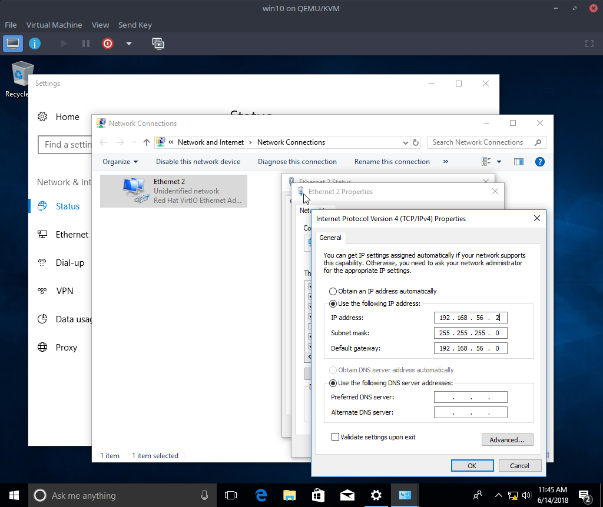

KVM is a part of the Linux kernel that allows it to act as a hypervisor, which sounds cool enough to make you feel silly for installing VirtualBox in the first place. But, VirtualBox does come with a useful host-only network adapter and it's not immediately obvious how to duplicate it in KVM.

The host-only adapter should allow your virtual machine to connect to your host without giving it access to the outside network (which can be really important if you have a client-server setup without authentication, like in [Aenea](https://github.com/dictation-toolbox/aenea)).

The screenshots below are of virt-manager, which sits on top of KVM and lets us work with a familiar GUI. The alternative is learning how to use virsh on the command line.

Find the `Connection Details` dialog in virt-manager under the `Edit` menu. Create a new virtual network like so:

Next tab over to `Network Interfaces` and create a new interface:

Configure your virtual machine to use this network interface, reboot, and finish configuring in Windows.

This setup should allow the aenea client to connect to the server running on your desktop.
